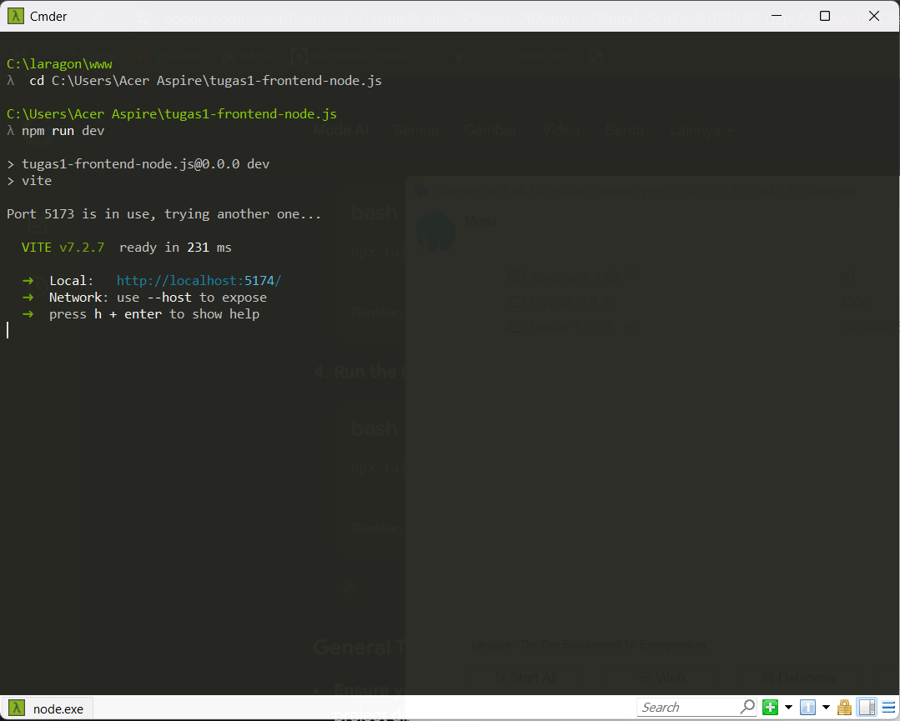
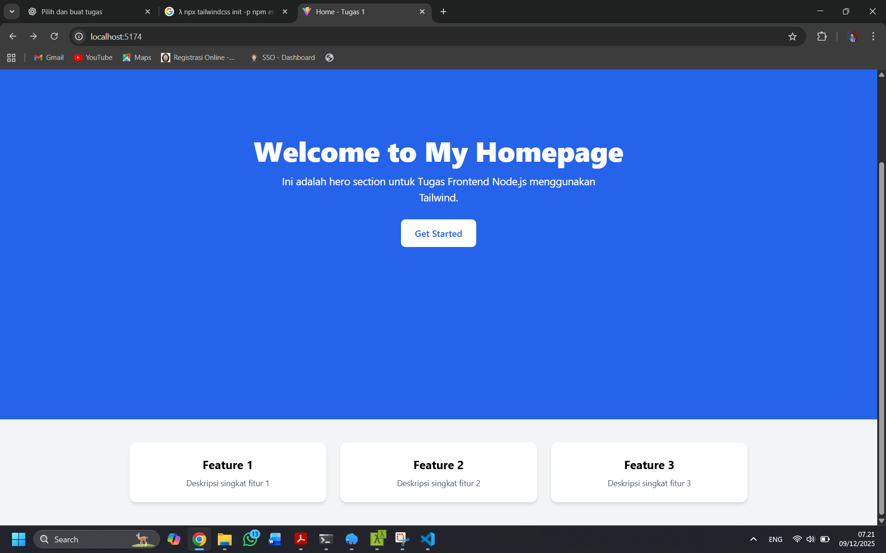

# Tugas 1 - Static Homepage (Frontend Node.js)

##  Deskripsi
Proyek ini merupakan halaman homepage sederhana menggunakan Vite + Tailwind CSS sebagai bagian dari Tugas Frontend Node.js Pertemuan 12.

Halaman terdiri dari:
- Hero Section
- 3 Card fitur
- CTA Button
- Layout responsif (mobile-first)
- Styled dengan Tailwind CSS

##  Teknologi yang Digunakan
- Node.js
- Vite
- Tailwind CSS v3
- ES Modules (import/export)

##  Struktur Folder
src/
├ components/
│ ├ Hero.js
│ └ Card.js
├ main.js
├ style.css
index.html
tailwind.config.js
postcss.config.js

##  Cara Menjalankan Proyek
```bash
npm install
npm run dev
Lalu buka link Local server yang tertampil di terminal, contoh:
http://localhost:5173/
```

##  Screenshot Terminal


##  Screenshot Tampilan Browser


